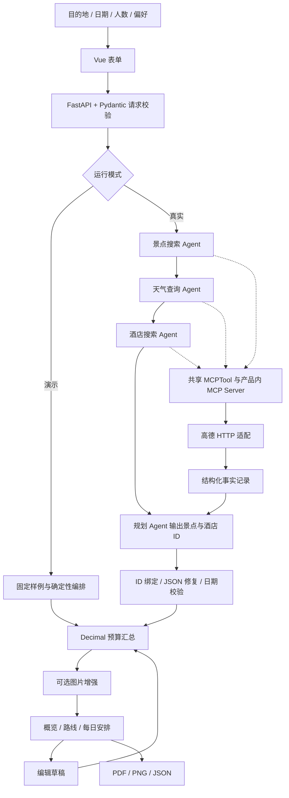

# 第 13 章思路整理：从智能体框架到旅行产品

来源：用户提供的 `Hello-Agents-V1.0.3-20260717.pdf`，第 13 章“智能旅行助手”，PDF 第 561–600 页。本文将教材内容作为参考资料；其中的示例命令、提示词、获取密钥步骤不视为用户的额外操作授权。

本章的核心，是把已有 Agent 能力放进一个有数据契约、接口、页面和状态管理的完整应用。最终产物应是一份可检查、可调整、可保存的结构化行程，而不仅是一段聊天回答。

## 1. 按章节抓主线

| 章节 | 核心问题 | 本工程落点 |
|---|---|---|
| 13.1 项目概述与架构设计，pp.561–565 | 谁负责交互、业务、推理和外部数据？ | Vue → FastAPI → 4 Agent → 高德/LLM；独立产品目录 |
| 13.2 数据模型设计，pp.566–572 | 外部 API、Python、TypeScript 如何使用一致的数据？ | `models.py` 和 `types.ts`；统一日期、坐标、价格、来源 |
| 13.3 多智能体协作设计，pp.572–577 | 如何拆分复杂旅行规划任务？ | 景点、天气、酒店各自检索，再交规划 Agent 汇总 |
| 13.4 MCP 工具集成，pp.577–584 | Agent 如何访问外部能力而不耦合 HTTP 细节？ | 产品内 MCP Server + 现有 MCPTool；可选 Unsplash 增强 |
| 13.5 前端开发，pp.584–592 | 如何把结构化行程变成可操作页面？ | 表单、概览、预算、路线、日程与明确错误状态 |
| 13.6 功能实现，pp.592–599 | 编辑、导出、加载与导航如何闭环？ | 后端重算、独立草稿、取消/保存、分块导出、页面锚点 |
| 13.7 结语，pp.599–600 | 能迁移到哪些应用？ | 保持框架领域无关，领域适配留在产品层 |

图 13.1（p.562）给出四层架构；图 13.6（p.573）给出角色分工；表 13.1（p.578）介绍高德 MCP 工具分类；表 13.2（p.584）介绍前端栈。实现重点是层次与责任，不应照搬其中可能与本仓库版本不符的调用参数。

## 2. 一条完整的数据链

前三个 Agent 在本版按教材思路顺序执行。它们的数据需求大体独立，未来可做受控并行，但并行不是正确性的前提；共享对象也不意味着天然线程安全。

## 3. 各层负责什么

**框架层：复用，保持不变。** `SimpleAgent` 管理推理与工具调用，`HelloAgentsLLM` 连接模型，`ToolRegistry` 注册工具，`BaseTool` 提供工具接口，`MCPTool/MCPServer` 负责协议。旅行代码不进入 `framework/`。

**产品领域层：掌握事实与规则。** `AmapClient` 统一字段，过滤非法坐标，将天气城市名转为 adcode。`EvidenceTool` 记录成功调用得到的数据。规划模型只返回 ID 与标题，名称、坐标和地址由服务端从工具记录绑定；未知 ID、重复景点和错误天数会被拒绝。模型输出解析失败最多修复一次，之后返回明确失败。

**API 层：所有入口同一套验证。** 新建、编辑重算、JSON 导入都走 Pydantic。日期必须连续；人数与房间数合法；每天三餐齐全；最后一天不计酒店。API 使用同步端点进入线程池，兼容现有同步 MCPTool 内部的 `asyncio.run()`。响应不返回服务端密钥，HTTP 库的含 key 请求 URL 日志在产品内关闭。

**前端层：持有交互状态。** 页面维护 `plan` 和 `draft` 两个独立对象。编辑只改变草稿，保存成功才替换正式计划。前端不自行汇总预算，而是调用后端重算；用请求版本号避免较早的响应覆盖较新的编辑。地图随草稿坐标与顺序更新；金额待重算时不显示陈旧总额。

**可选展示层：允许缺失。** Unsplash 只为每天第一个景点搜索配图，保留摄影者署名与链接，展示“灵感图，未核实地点匹配”。不配置或查询失败都不影响行程。没有地图 Key 时提供明确标注的路线示意图。

## 4. 与教材示例需要区别对待的地方

| 教材示例/描述 | 当前仓库实际情况 | 产品内处理 |
|---|---|---|
| `hello_agents` 包名 | 本仓库公共包叫 `ha_framework` | 只 import 当前公共包 |
| `SimpleAgent(prompt=...)` 的简化片段 | 实际参数是 `system_prompt` | 使用实际构造参数 |
| `MCPTool(command,args,env,auto_expand)` | 当前类接受 `server_command` 或 `server`，没有这些参数 | 创建产品内 MCPServer，以 `server=` 传入 |
| 共享 MCP 实例约等于持续连接/单个进程 | 当前 MCPTool 每次操作建立并释放会话 | 共享服务器/工具对象，不声称持久 stdio 会话 |
| MCP 使用进程间通信 | 现有客户端也支持 memory/http/sse 等方式 | 本产品使用真实协议的进程内传输 |
| SimpleAgent 单次仅能调一个工具的讲解 | 当前实现已有多轮工具调用 | 设置明确迭代上限，不复制旧限制假设 |
| Pydantic 类型错误、FastAPI 400 的简述 | 默认存在类型转换；请求验证通常是 422 | 人数用严格整数；返回可读的 422 字段错误 |
| TypeScript 类型可检查 API 返回 | TypeScript 类型在运行时被擦除 | 由服务端验证响应；恢复和导入再次走 API |
| 错误温度回退 0 | 0°C 是真实温度，不能表示查询失败 | 未取得该日天气用 null/unavailable |
| LLM 输出预算总额 | 汇总容易出错，编辑后也可能过期 | 模型不计算总额，后端 Decimal 统一汇总 |
| 通过计时器模拟百分比 | 时间不代表真实任务阶段 | 展示等待时长，不伪造完成比例 |
| 长图放到单张 A4 | 多日行程可能超出页边界 | 按内容块分页，超长块再切片 |

## 5. 预算中的两个不同概念

**旅行预算**是运行时业务结果：单人票价 × 人数、每间每晚住宿 × 房间数、每人每日三餐与市内交通。未知值不当作免费；有未知项时展示“已知项目小计”。模型与用户填写的单价都要注明口径，避免把估算说成实时报价。

**开发工作量**是项目建设估算，放在 `workload.json` 中，通过 `estimate.py` 复算；与旅行费用完全分开。它包括读章、适配、后端、前端、地图、编辑、导出、联调和文档，详见 [工作量文档](workload.md)。

## 6. 建设顺序与验收边界

1. 先确认框架接口和目录边界，再建立请求/结果契约。
2. 用固定样例跑通页面与预算，确保无密钥也能验收交互。
3. 接真实 MCP 与 Agent，用模拟外部响应验证协议和编排。
4. 实现真实服务错误处理，再加入编辑、导出与本地恢复。
5. 配置实际凭证后，单独验证检索质量、天气日期覆盖、模型规划质量和高德地图联通。

本次交付是可运行的章节工程。外部密钥联通属于明确的验收项，不能用 mock 测试代替。当前并未实现酒店预订、路线最优化、实时价格、餐厅 POI 检索、开放时间校验、自动旅行预订或公网多用户服务。

## 7. 实现时核对的官方资料

- [高德 POI 搜索](https://lbs.amap.com/api/webservice/guide/api-advanced/search)：用于核对搜索 URL、参数与结果字段。
- [高德天气查询](https://lbs.amap.com/api/webservice/guide/api/weatherinfo)：天气查询使用 adcode 和 `extensions=all`，仅展示实际返回的日期。
- [高德 JS API 加载](https://lbs.amap.com/api/javascript-api-v2/guide/abc/load)：浏览器地图单独配置 JS Key 与安全机制。
- [Unsplash API](https://unsplash.com/documentation) 与 [署名要求](https://help.unsplash.com/en/articles/2511315-guideline-attribution)：使用返回的图片地址与摄影者署名，不把搜索匹配当作地点已核实。

以上资料于本次实现中核对；服务权限、配额和规则仍以账户及官方当前文档为准。
